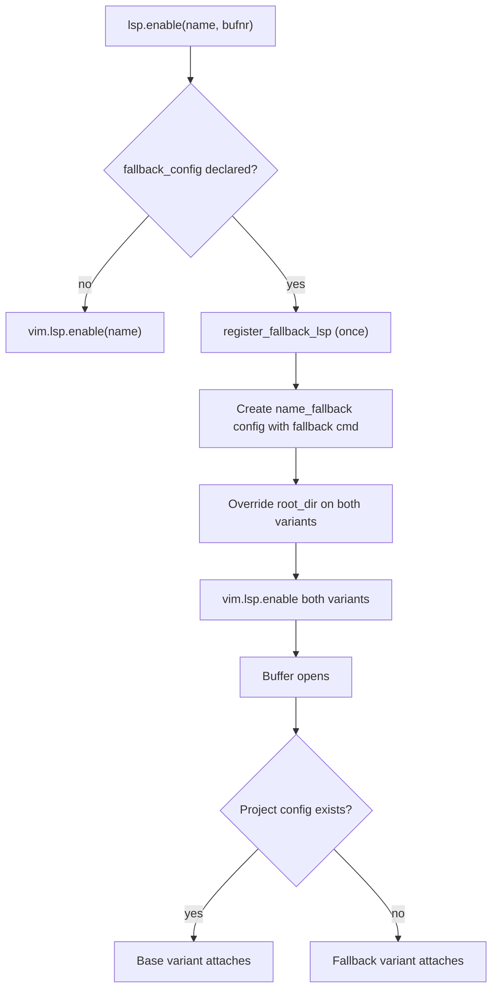

# Dual LSP instance fallback

Some LSP servers accept a `--config` flag at launch. Once the server starts, its
command is frozen — mutating `vim.lsp.config` after attach has no effect. This
framework registers two LSP configs upfront (base and fallback) and uses
conditional `root_dir` callbacks to ensure exactly one attaches per buffer.

## Why

The naive approach updates the LSP command dynamically based on whether a
project config exists:

```lua
-- Too late — server already started with the old command
vim.lsp.config("rumdl", { cmd = new_cmd })
```

Pre-registering two variants with different commands avoids the race.

## How it works

1. An LSP config declares a `fallback_config` field pointing to a
   [`FallbackSpec`][fc]:

   ```lua
   -- lsp/rumdl.lua
   return {
     cmd = { "rumdl", "server", "--stdio" },
     fallback_config = require("lib.rumdl").fallback_spec,
   }
   ```

2. On first `lsp.enable("rumdl")`, [`lua/lib/lsp.lua`][lsp] detects the
   `fallback_config` field and calls [`register_fallback_lsp("rumdl")`][fc].

3. `register_fallback_lsp` creates a `rumdl_fallback` config whose `cmd` appends
   the fallback config flags (e.g.,
   `--config ~/.config/nvim/configs/rumdl.toml`).

4. Both configs get a conditional `root_dir` function:
   - **Base** — only calls `on_dir` when a project config file exists.
   - **Fallback** — only calls `on_dir` when no project config exists.

   Since `root_dir` is the gating mechanism, at most one variant attaches to any
   buffer.

## FallbackSpec

```lua
---@class FallbackSpec
---@field names string[]      -- config file names (e.g., { ".rumdl.toml" })
---@field flag string|string[] -- CLI flag(s) before the fallback path
---@field fallback string      -- absolute path to fallback config
---@field extra_dirs? string[] -- dirs relative to git root to check
```

`has_project_config(spec, path)` searches upward from the buffer path to the git
root, then checks `extra_dirs`. `flags(spec, path)` returns either `{}` (project
config found) or `{ flag, fallback }` (no project config).

## Flow



## Where the logic lives

| File                                | Role                                                         |
| ----------------------------------- | ------------------------------------------------------------ |
| [`lua/lib/fallback_config.lua`][fc] | Core: `register_fallback_lsp`, `has_project_config`, `flags` |
| [`lua/lib/lsp.lua`][lsp]            | Integration: detects `fallback_config` on first enable       |
| [`lua/lib/rumdl.lua`][rumdl]        | Rumdl-specific `FallbackSpec` definition                     |
| [`lsp/rumdl.lua`][lsp-rumdl]        | LSP config that declares `fallback_config`                   |

Formatters reuse the same `FallbackSpec` via `flags()`. See
[`lua/lib/prettier.lua`][prettier] for the Prettier example.

## Trade-offs

- Two LSP configs per server adds naming noise (`rumdl` + `rumdl_fallback`).
- `has_project_config` does filesystem traversal on each buffer open. The search
  stops at the git root, so depth is bounded.
- The framework assumes config file presence is static for the session. Moving
  or creating a config mid-session won't switch variants until the server
  restarts.

[fc]: ../lua/lib/fallback_config.lua
[lsp]: ../lua/lib/lsp.lua
[lsp-rumdl]: ../lsp/rumdl.lua
[prettier]: ../lua/lib/prettier.lua
[rumdl]: ../lua/lib/rumdl.lua
