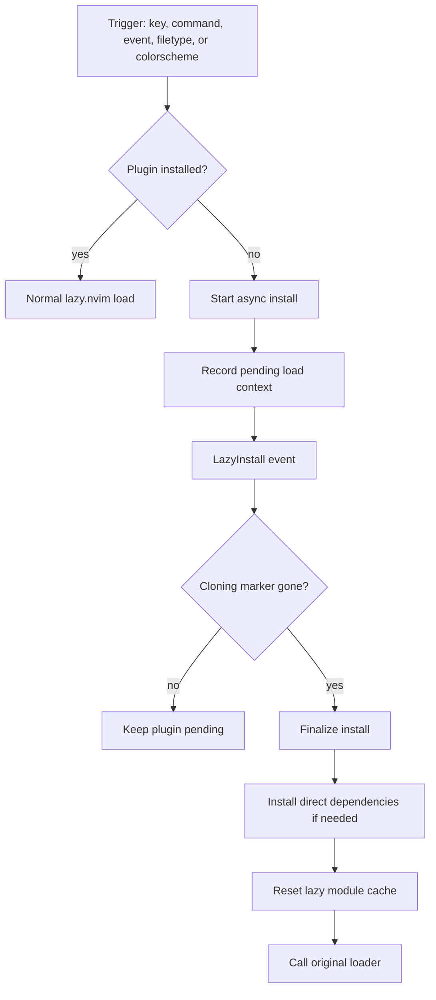

# On-demand plugin install

[lazy.nvim][lazy] provides plugin specs, lazy triggers, and the base install
machinery. This config patches its loader so a missing plugin is cloned only
when some real action asks for it.

## Why

The goal is to keep fresh machines small and keep startup quiet on cloud VMs,
containers, and other constrained environments.

## Flow

## Where the logic lives

- `init.lua` enables the patch on `VeryLazy`.
- `lua/lib/lazy_ondemand.lua` owns the patched loader, pending install state,
  colorscheme handling, and `lazy_require`.
- `lua/plugins/oil.lua`, `lua/plugins/snacks.lua`, and
  `lua/plugins/toggleterm.lua` show the safe call pattern for plugin modules
  that may not exist yet.
- `lua/lib/bootstrap.lua` simulates startup for `./scripts/install.sh`.

## Important behavior

- The first trigger installs the plugin. It does **not** replay the original
  command or keypress. The next trigger does the real work after install
  finishes.
- `lazy_require` returns a no-op proxy. Use it only where a silent no-op is an
  acceptable fallback.
- If the caller needs a real return value, guard with `package.loaded[...]`
  instead. See `lua/plugins/ts-context-commentstring.lua`.
- Colorschemes are a special case. They install synchronously so `:colorscheme`
  can apply immediately.
- Direct dependencies may block briefly after the main clone. That gives plugin
  `config` a stable environment for `require()`.

## Extension points

- Add plugin specs normally. The patch works with lazy triggers already present
  in the spec.
- Use `lazy_require` in `init`, key callbacks, and command callbacks that may
  run before the plugin is cloned.
- For theme plugins, declare a `themes` field so the colorscheme matcher can
  find them.

## Trade-offs

- This relies on internal [lazy.nvim][lazy] APIs, especially
  `lazy.core.loader.Loader._load`.
- The cloning marker is the readiness signal. Recovery from corrupted clone
  state is still manual.
- Error suppression around pending installs must stay narrow, or real failures
  get hidden.

## Related docs

- [On-demand tool install][on-demand-tool]
- [`./scripts/install.sh`][install-script]
- [`lua/lib/bootstrap.lua`][bootstrap]

[bootstrap]: ../lua/lib/bootstrap.lua
[install-script]: ../scripts/install.sh
[lazy]: https://lazy.folke.io/
[on-demand-tool]: ./on-demand-tool.md
