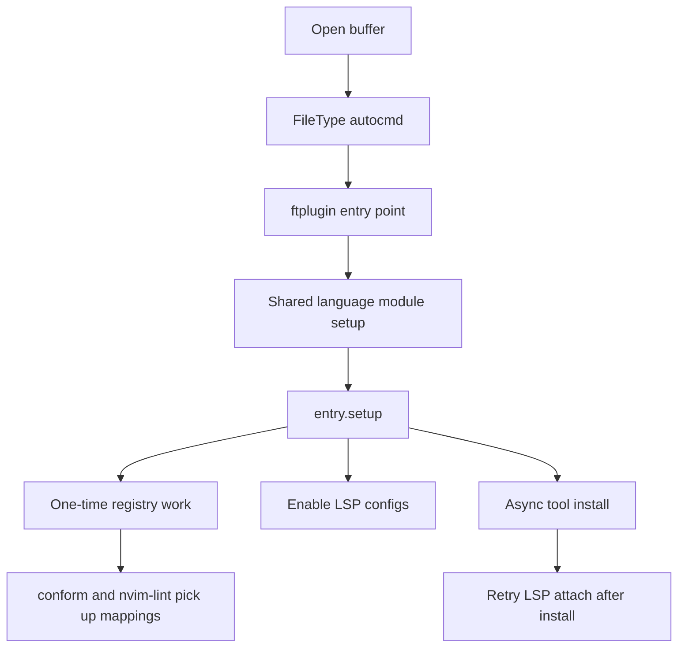

# On-demand tool install

Language wiring lives in small `ftplugin` entry points and shared language
modules. Opening a buffer registers formatters and linters, enables LSP configs,
and installs missing binaries in the background.

## Why

The goal is to keep a new machine light until a language is actually edited
while keeping tool ownership in one place.

## Flow

## Where the logic lives

- `ftplugin/<ft>.lua` is the entry point per filetype.
- `lua/langs/shared/entry.lua` splits one-time language setup from buffer-local
  setup.
- `lua/lib/tools.lua` checks PATH, installs missing runtimes, and installs the
  missing tools.
- `lua/lib/lang_registry.lua` owns formatter and linter mappings.
- `lua/lib/lang_registry_gen.lua` is the generated fast path for formatter
  lookup.
- [tools.txt][tools-txt] is the eager install path used by `mise run sync`.

## Important behavior

- `entry.setup(key, bufnr, opts)` runs registry work once per language key.
- Passing `bufnr = nil` runs only the one-time path. Generated formatter loaders
  use that mode to register custom formatter definitions on first access.
- LSP enable is attempted once before tool install and again after install
  finishes. That covers the common case where the server binary was missing on
  the first open.
- Some filetypes need runtime installs before the real tool install. Today that
  means `go`, `node`, `rust`, or `dotnet`, depending on the [mise][] spec.
- Tree-sitter parser auto-install follows the same philosophy but lives in
  `lua/lib/treesitter.lua`, not in `lua/lib/tools.lua`.

## Extending it

When a new language is added, it touches three places:

1. `ftplugin/<ft>.lua`
2. a shared language module under `lua/langs/shared/`
3. [tools.txt][tools-txt]

That keeps filetype detection, editor wiring, and install metadata in sync.

## Trade-offs

- Tool installs are global because the config uses `mise use -g`.
- The first buffer for a language may gain features in stages while installs
  finish.
- Failed installs surface as notifications. There is no retry queue yet.
- The generated formatter registry is fast, but it adds one more artifact to
  keep in sync.

## Related docs

- [On-demand plugin install][on-demand-plugin-install]
- [`tools.txt`][tools-txt]
- [`lua/lib/treesitter.lua`][treesitter]

[mise]: https://mise.jdx.dev/
[on-demand-plugin-install]: ./on-demand-plugin-install.md
[tools-txt]: ../tools.txt
[treesitter]: ../lua/lib/treesitter.lua
