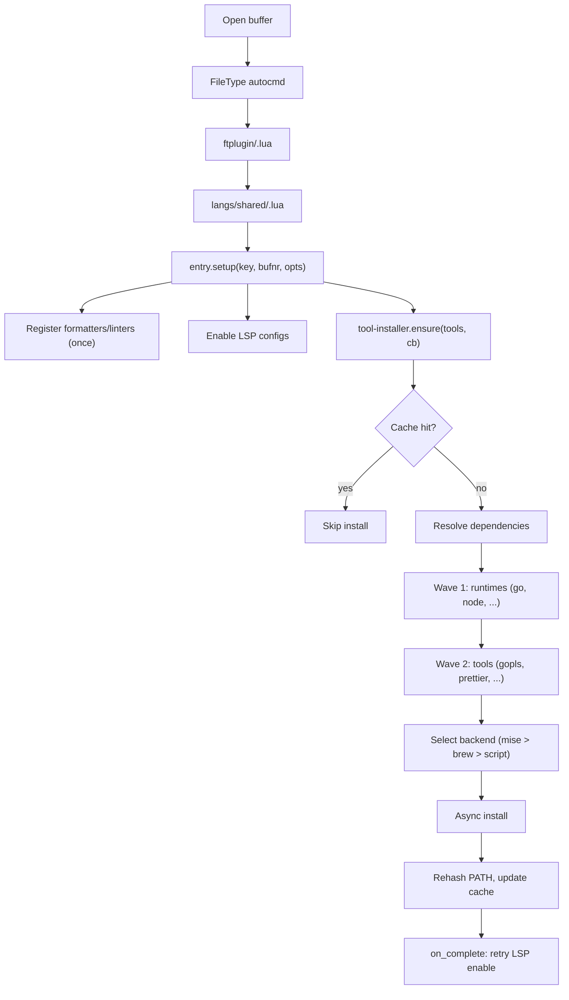

# On-demand tool install

Language tooling (LSPs, formatters, linters) installs in the background the
first time a filetype is opened. The [tool-installer][tool-installer] local
plugin owns the install logic; language modules declare what to install.

## Why

A fresh machine stays light until a language is actually edited. Tool ownership
lives in one place per language, and installs are deferred behind a cache so
repeat opens are free.

## Flow



## Where the logic lives

- [`ftplugin/<ft>.lua`][ftplugin] -- one-liner entry point per filetype
- [`lua/langs/shared/<lang>.lua`][langs] -- tool specs, LSP names,
  formatter/linter mappings
- [`lua/langs/shared/entry.lua`][entry] -- splits one-time language setup from
  buffer-local setup; calls `tool-installer.ensure()` and retries LSP attach in
  the callback
- [`plugins/tool-installer/`][tool-installer] -- cache, dependency resolution,
  backend selection, async install
- [`lua/lib/lang_registry.lua`][registry] -- formatter and linter mappings for
  conform and nvim-lint
- [`lua/lib/lang_registry_gen.lua`][registry-gen] -- generated fast path for
  formatter lookup

See `:help tool-installer` for the full API, tool spec format, backend details,
and cache behavior.

## Important behavior

- `entry.setup(key, bufnr, opts)` registers formatters, linters, and `once()`
  hooks exactly once per language key. During startup it defers buffer-local
  work to `VeryLazy`.
- LSP enable runs before tool install and again in the `on_complete` callback.
  That covers the common case where the server binary was missing on first open.
- Dependencies use a two-wave install: wave 1 installs runtimes from the
  [catalog][catalog-setup], wave 2 installs tools that depend on them. If a
  runtime fails, its dependents are skipped.
- Concurrent `ensure()` calls for the same binary subscribe to the in-flight
  install instead of spawning duplicates.
- Results are cached at `~/.cache/nvim/tool-installer.json` with a configurable
  TTL (default 1 hour). Delete the file to force re-verification on next open.
- Tree-sitter parser auto-install follows the same philosophy but lives in
  [`lua/lib/treesitter.lua`][treesitter], not in tool-installer.

## Extending it

Adding a new language touches two places:

1. `ftplugin/<ft>.lua` -- call the shared language module
2. `lua/langs/shared/<lang>.lua` -- declare tool specs, LSP, formatters, linters

Example (`lua/langs/shared/go.lua`):

```lua
require("langs.shared.entry").setup("go", bufnr, {
  tools = {
    { bin = "gopls", mise = "go:golang.org/x/tools/gopls",
      dependencies = { "go" } },
  },
  lsp = "gopls",
  formatters = { "goimports", "gofumpt" },
  linters = { "golangcilint" },
})
```

If the language needs a runtime not yet in the catalog, add it to the
`tool-installer.setup()` call in the plugin config.

## Trade-offs

- Tool installs are global (`mise use -g`). No per-project version pinning
  unless the project has its own `.mise.toml`.
- The first buffer for a language may gain features in stages while installs
  finish.
- Failed installs surface as notifications. There is no retry queue.
- The generated formatter registry adds one more artifact to keep in sync.

## Related docs

- [On-demand plugin install][on-demand-plugin]
- [`:help tool-installer`][help] -- full API reference

[catalog-setup]: ../plugins/tool-installer/doc/tool-installer.txt
[entry]: ../lua/langs/shared/entry.lua
[ftplugin]: ../ftplugin
[help]: ../plugins/tool-installer/doc/tool-installer.txt
[langs]: ../lua/langs/shared
[on-demand-plugin]: ./on-demand-plugin.md
[registry]: ../lua/lib/lang_registry.lua
[registry-gen]: ../lua/lib/lang_registry_gen.lua
[tool-installer]: ../plugins/tool-installer
[treesitter]: ../lua/lib/treesitter.lua
