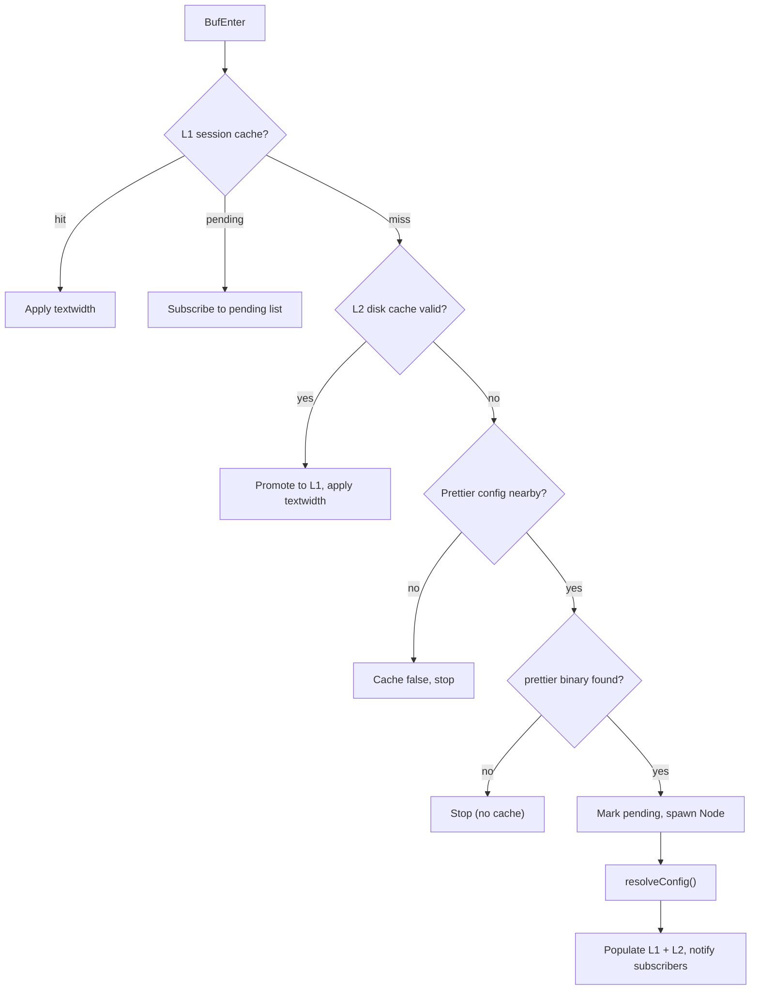

# Prettier textwidth sync

When a buffer opens in a project with a prettier config, `printWidth` is
async-resolved via Node and applied as `textwidth` + `colorcolumn`. The result
is cached at two tiers so repeated opens are instant.

## Why

Neovim's `textwidth` defaults to 0 (off) or whatever the user sets globally.
Projects that use prettier enforce a different line width, but Neovim has no way
to know that. Manually setting `textwidth` per project is tedious and drifts.
This feature reads the authoritative value from prettier's own config resolution
and keeps the editor in sync.

## How it works

### L1: session cache

A Lua table keyed by `<git_root>::<extension>` stores resolved `printWidth`
values (or `false` for negative results). Lookups are a hash-table hit with no
I/O. The cache lives for the Neovim session.

### L2: disk cache

`~/.cache/nvim/prettier-pw.json` persists results across sessions. Each entry
stores the `printWidth` value and the config file's `mtime` (seconds). On
lookup, the disk entry is valid only when the config file's current `mtime`
matches. The disk cache is loaded lazily on first miss and flushed on
`VimLeavePre`.

### Node resolve

When both caches miss:

1. Search upward from the buffer path to the git root for any of the 14 prettier
   config file names, plus a `package.json` with a `"prettier"` key.
2. Locate the `prettier` binary via `exepath`.
3. Spawn `node -e <script>` that requires prettier's `resolveConfig()` from the
   binary's real path. This handles all config formats and per-file overrides.
4. Parse `printWidth` from stdout, populate both caches, and apply.

### Pending dedup

While a Node resolve is in-flight, the session cache holds `"pending"` for that
key. Additional buffers that need the same key subscribe to a pending list
instead of spawning another process. When the resolve completes, all subscribers
receive the result.

### set_textwidth

`vim.bo[buf].textwidth = tw` alone does not fire `OptionSet`. The helper also
schedules a `setlocal textwidth=<tw>` command so listeners like
[virtcolumn.nvim][virtcolumn] can react via `OptionSet` to update `colorcolumn`.

## Resolve flow

## Where the logic lives

- [`lua/lib/prettier.lua`][prettier] -- tool spec, fallback config, printWidth
  resolution, two-tier cache, `set_textwidth` helper
- [`lua/options.lua`][options] -- `BufEnter` autocmd that triggers
  `resolve_print_width` for normal file buffers
- [`lua/lib/fallback_config.lua`][fallback] -- shared config-file search used by
  `has_prettier_config`

## Trade-offs

- The Node spawn adds ~50-150 ms on first open per project+extension pair. The
  two-tier cache eliminates this cost on subsequent opens.
- Cache is keyed by git root + extension, not by individual file. Per-file
  prettier overrides that set different `printWidth` values for different files
  with the same extension in the same repo will use whichever resolves first.
- The disk cache is never pruned. Stale entries (deleted projects) accumulate
  but are small. Deleting `~/.cache/nvim/prettier-pw.json` is safe.
- `exepath("prettier")` is called on every cache miss (not cached). This is fast
  but means a missing binary is re-checked each time until it appears.

## Related docs

- [On-demand tool install][on-demand-tool] -- how `prettier` is auto-installed
- [Cascading exrc][exrc] -- project-local config that may also set `textwidth`

[exrc]: ./cascading-exrc.md
[fallback]: ../lua/lib/fallback_config.lua
[on-demand-tool]: ./on-demand-tool.md
[options]: ../lua/options.lua
[prettier]: ../lua/lib/prettier.lua
[virtcolumn]: https://github.com/lukas-reineke/virt-column.nvim
