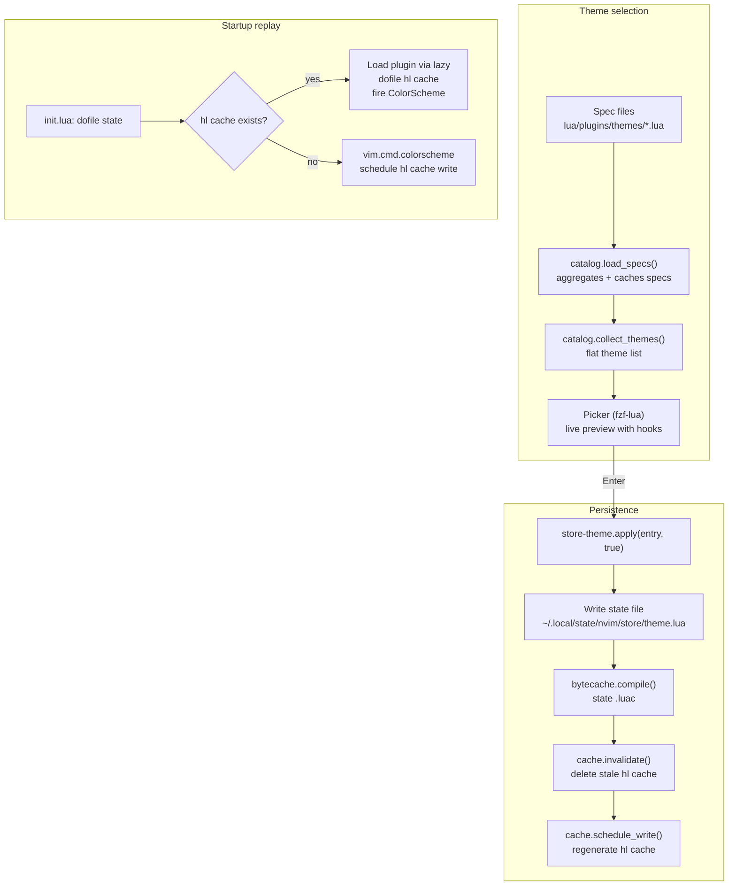

# store-theme

`store-theme` is a local plugin that persists the active colorscheme to a Lua
file and provides an [fzf-lua][fzf-lua]-based picker with live preview. It owns
the full theme pipeline from selection through startup replay.

## Why

Theme plugins (catppuccin, tokyonight, etc.) each define their own setup logic,
highlight computations, and integration options. Switching themes means more
than calling `:colorscheme` -- some need `before`/`after` hooks (e.g., setting
`vim.o.background`). A central pipeline handles persistence, hook execution, and
highlight caching so `init.lua` stays a thin consumer.

## Theme catalog

Each theme plugin has a spec file under `lua/plugins/themes/` (e.g.,
`catppuccin.lua`). A spec returns a [lazy.nvim][lazy] plugin table extended with
a `themes` list:

```lua
return {
  "catppuccin/nvim",
  name = "catppuccin",
  lazy = true,
  themes = {
    "catppuccin-latte",
    "catppuccin-frappe",
    "catppuccin-macchiato",
    "catppuccin-mocha",
  },
}
```

Themes can be plain strings or tables with `colorscheme`, `name`, `before`, and
`after` fields for hooks.

[`catalog.lua`][catalog] aggregates all spec files into a single list. It
maintains a compiled cache at `~/.local/state/nvim/theme-spec_gen.lua` --
rebuilt when any spec file changes (mtime comparison) or a new spec is
added/removed (file list signature). The cache is bytecode-compiled via
[`lib/bytecache`][bytecache] for fast `dofile()` on subsequent loads.

## Picker

Open with `<leader>ft` or call `require("store-theme").pick()`.

The picker lists every colorscheme from the catalog via
`catalog.collect_themes()`. The cursor starts on the currently active theme.
Behavior:

| Key     | Action                                |
| ------- | ------------------------------------- |
| `<CR>`  | Apply and persist (survives restarts) |
| `<C-s>` | Apply for this session only           |
| `<Esc>` | Cancel and restore the previous theme |

Live preview applies each theme as the cursor moves, including `before`/`after`
hooks. On cancel, the original theme and hooks are restored.

## Persistence

When the user confirms a theme (`<CR>`), `store-theme.apply(entry, true)` runs:

1. Executes the entry's `before` hook (e.g., `vim.o.background = "dark"`)
2. Calls `vim.cmd.colorscheme(entry.colorscheme)`
3. Executes the `after` hook
4. Calls `store-theme.save(entry)`, which:
   - Writes `~/.local/state/nvim/store/theme.lua` -- a Lua chunk returning a
     table with `colorscheme`, `before`, `after`, and `plugin` fields
   - Bytecode-compiles the state file (`.luac` sibling)
   - Deletes the stale highlight cache immediately
   - Schedules highlight cache regeneration

The state file is minimal:

```lua
return {
  colorscheme = "catppuccin-mocha",
  before = "",
  after = "",
  plugin = "catppuccin",
}
```

The `plugin` field is resolved by searching the catalog for which spec owns the
colorscheme name. `init.lua` uses it to tell lazy.nvim which plugin to load
before replaying the highlight cache.

## Integration with highlight cache

`store-theme` owns highlight cache generation and invalidation. See
[theme-cache.md][theme-cache] for the full startup replay flow. The key
interactions:

- **On save** -- `cache.invalidate()` deletes the highlight cache file, then
  `cache.schedule_write(colorscheme)` queues regeneration. The delete-then-write
  order ensures a crash between the two never leaves `init.lua` trusting a stale
  cache.
- **On plugin update** -- lazy.nvim post-update hooks call `cache.invalidate()`.
- **On spec file change** -- a `VeryLazy` check detects modified theme specs and
  invalidates.
- **On startup** -- `init.lua` reads the state file via `bytecache.load()`,
  checks for the highlight cache, and either replays it (fast path, sub-5 ms) or
  falls back to `vim.cmd.colorscheme()` (slow path) and schedules cache
  generation.

## Full pipeline



## Where the logic lives

- [`plugins/store-theme/lua/store-theme/init.lua`][store] -- state persistence,
  `apply()` and `save()` API
- [`plugins/store-theme/lua/store-theme/picker.lua`][picker] -- fzf-lua picker
  with live preview and hook restoration
- [`plugins/store-theme/lua/store-theme/cache.lua`][cache] -- highlight cache
  write, invalidation, and scheduled regeneration
- [`plugins/store-theme/lua/store-theme/hook.lua`][hook] -- `before`/`after`
  hook executor (`load()` + `pcall`)
- [`lua/plugins/themes/catalog.lua`][catalog] -- theme spec aggregation and spec
  cache
- [`lua/plugins/themes/init.lua`][themes-init] -- registers all theme specs with
  lazy.nvim, adds the `store-theme` plugin entry
- [`lua/lib/bytecache.lua`][bytecache] -- `.luac` compilation and loading
- [`init.lua`][init] -- startup consumer: reads state, replays hl cache or falls
  back

## Trade-offs

- The catalog cache (`theme-spec_gen.lua`) uses mtime comparison, not content
  hashing. Touching a spec file without changing it triggers a rebuild. The
  rebuild is cheap (concatenate a few files) so this is acceptable.
- The `plugin` field in the state file is derived from the catalog at save time.
  Renaming a plugin in its spec without re-saving the theme leaves a stale
  `plugin` value. The fallback (`loader.colorscheme`) still works but may be
  slower.
- Per-project overrides via `.nvim.lua` apply after store-theme loads. They
  affect the session but not the persisted global theme or the highlight cache.
- Hooks are arbitrary Lua strings evaluated via `load()`. They run in the global
  environment with no sandboxing -- appropriate for user-authored config, not
  for untrusted input.

## Related docs

- [theme-cache.md][theme-cache] -- startup highlight cache details and
  invalidation flow
- [on-demand-plugin.md][on-demand-plugin] -- theme plugins lazy-load via the
  on-demand install machinery

[bytecache]: ../lua/lib/bytecache.lua
[cache]: ../plugins/store-theme/lua/store-theme/cache.lua
[catalog]: ../lua/plugins/themes/catalog.lua
[fzf-lua]: https://github.com/ibhagwan/fzf-lua
[hook]: ../plugins/store-theme/lua/store-theme/hook.lua
[init]: ../init.lua
[lazy]: https://github.com/folke/lazy.nvim
[on-demand-plugin]: ./on-demand-plugin.md
[picker]: ../plugins/store-theme/lua/store-theme/picker.lua
[store]: ../plugins/store-theme/lua/store-theme/init.lua
[theme-cache]: ./theme-cache.md
[themes-init]: ../lua/plugins/themes/init.lua
