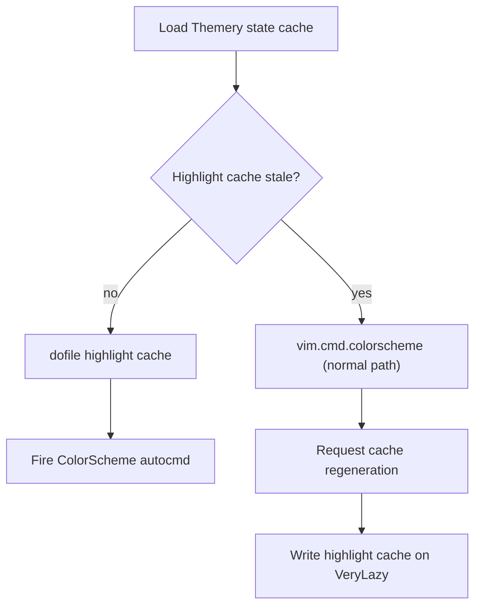

# Startup theme cache

The colorscheme applies instantly on repeat startups by replaying a cached
snapshot of every highlight group instead of running the theme plugin.

## Why

Theme plugins parse data structures, register autocommands, and compute
highlight groups on each load. That work is redundant when the colorscheme
hasn't changed. The cache converts the result into a flat Lua file of
`nvim_set_hl` calls that replays in under 5 ms.

## Two-layer cache

### Themery state cache

[Themery][themery] stores its selection in `state.json` (JSON). On first change,
`init.lua` converts it to a compiled Lua chunk at
`~/.local/share/nvim/state/themery-startup.lua` containing the colorscheme name,
before/after hook code, and the plugin that provides it. Subsequent startups
call `dofile()` and skip JSON decode entirely.

### Highlight group cache

After a colorscheme loads successfully, `init.lua` snapshots every highlight
group via `vim.fn.getcompletion("", "highlight")` and writes the result to
`~/.local/share/nvim/state/theme-highlight-startup.lua`. The file contains:

- `vim.g.colors_name` assignment
- Terminal colors 0–15 (if defined)
- One `nvim_set_hl` call per group with all properties (fg, bg, styles, links)

On next startup the cached file replays those calls directly, skipping the theme
plugin's init path.

## Staleness detection

The highlight cache is stale when any of these files are newer than it:

| File                  | Meaning                             |
| --------------------- | ----------------------------------- |
| `themery-startup.lua` | User picked a different colorscheme |
| `theme-spec_gen.lua`  | Theme plugin definitions changed    |
| `lazy-lock.json`      | Plugin versions updated             |

Staleness is checked via `fs_stat` mtime comparison. Results are memoized per
startup in `_mtime_cache` to avoid repeated syscalls.

## Startup flow

## Where the logic lives

- [`init.lua`][init] (lines 53–469) — cache loading, staleness checks, snapshot
  generation, and application
- [`lua/plugins/themes/catalog.lua`][catalog] — theme spec catalog caching
  (compiles all theme plugin definitions into a single Lua file)

## Trade-offs

- The highlight snapshot is a point-in-time copy. Plugins that modify highlights
  after `ColorScheme` (e.g., custom overrides in `after/`) still run, but their
  changes won't be in the cache until the next regeneration.
- Corrupted cache files fall back gracefully via `pcall(dofile, ...)`.
- Headless sessions write the cache immediately (no `VeryLazy` event).

## Related docs

- [On-demand plugin install][on-demand-plugin] — theme plugins lazy-load via the
  same on-demand machinery

[catalog]: ../lua/plugins/themes/catalog.lua
[init]: ../init.lua
[on-demand-plugin]: ./on-demand-plugin.md
[themery]: https://github.com/zaldih/themery.nvim
