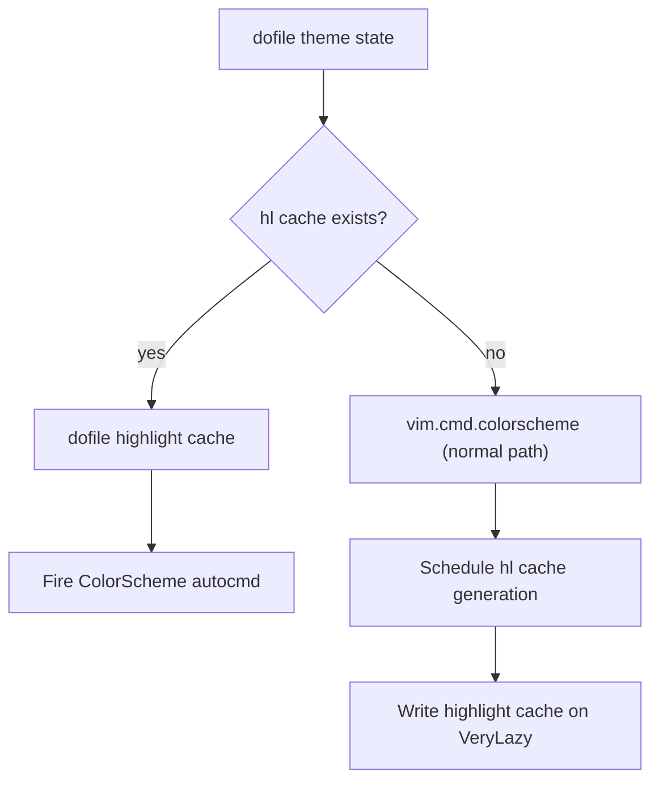

# Startup theme cache

The colorscheme applies instantly on repeat startups by replaying a cached
snapshot of every highlight group instead of running the theme plugin.

## Why

Theme plugins parse data structures, register autocommands, and compute
highlight groups on each load. That work is redundant when the colorscheme
hasn't changed. The cache converts the result into a flat Lua file of
`nvim_set_hl` calls that replays in under 5 ms.

## How it works

### Theme state

The [store-theme][store-theme] plugin persists the active colorscheme to a
single Lua file at `~/.local/state/nvim/store/theme.lua`. The file returns a
table with `colorscheme`, `before`/`after` hook code, and the lazy.nvim plugin
name. On startup, `init.lua` calls `dofile()` — no JSON decode, no staleness
check.

### Highlight group cache

After a colorscheme loads successfully, `store-theme` snapshots every highlight
group via `vim.fn.getcompletion("", "highlight")` and writes the result to
`~/.local/state/nvim/theme-highlight-startup.lua`. The file contains:

- `vim.g.colors_name` assignment
- Terminal colors 0–15 (if defined)
- One `nvim_set_hl` call per group with all properties (fg, bg, styles, links)

On next startup the cached file replays those calls directly, skipping the theme
plugin's init path.

### Cache validity

The highlight cache is valid-or-absent. `store-theme` owns invalidation:

- **On theme save** — writes state file + regenerates hl cache
- **On plugin update** — deletes hl cache (hooks Lazy post-update events)
- **On theme spec change** — deletes hl cache via `VeryLazy` check

`init.lua` has no staleness logic — if the hl cache file exists, it's used; if
missing, the normal `vim.cmd.colorscheme` path runs and `store-theme` schedules
cache generation.

## Startup flow

## Where the logic lives

- [`init.lua`][init] — thin loader: reads state file, applies hl cache or falls
  back to normal colorscheme load
- [`plugins/store-theme/lua/store-theme/cache.lua`][cache] — hl cache
  write/invalidate/schedule
- [`plugins/store-theme/lua/store-theme/init.lua`][store] — state persistence,
  theme application, picker
- [`lua/plugins/themes/catalog.lua`][catalog] — theme spec catalog caching
  (compiles all theme plugin definitions into a single Lua file)

## Trade-offs

- The highlight snapshot is a point-in-time copy. Plugins that modify highlights
  after `ColorScheme` (e.g., custom overrides in `after/`) still run, but their
  changes won't be in the cache until the next regeneration.
- Corrupted cache files fall back gracefully via `pcall(dofile, ...)`.
- Headless sessions write the cache immediately (no `VeryLazy` event).

## Related docs

- [On-demand plugin install][on-demand-plugin] — theme plugins lazy-load via the
  same on-demand machinery

[cache]: ../plugins/store-theme/lua/store-theme/cache.lua
[catalog]: ../lua/plugins/themes/catalog.lua
[init]: ../init.lua
[on-demand-plugin]: ./on-demand-plugin.md
[store]: ../plugins/store-theme/lua/store-theme/init.lua
[store-theme]: ../plugins/store-theme
