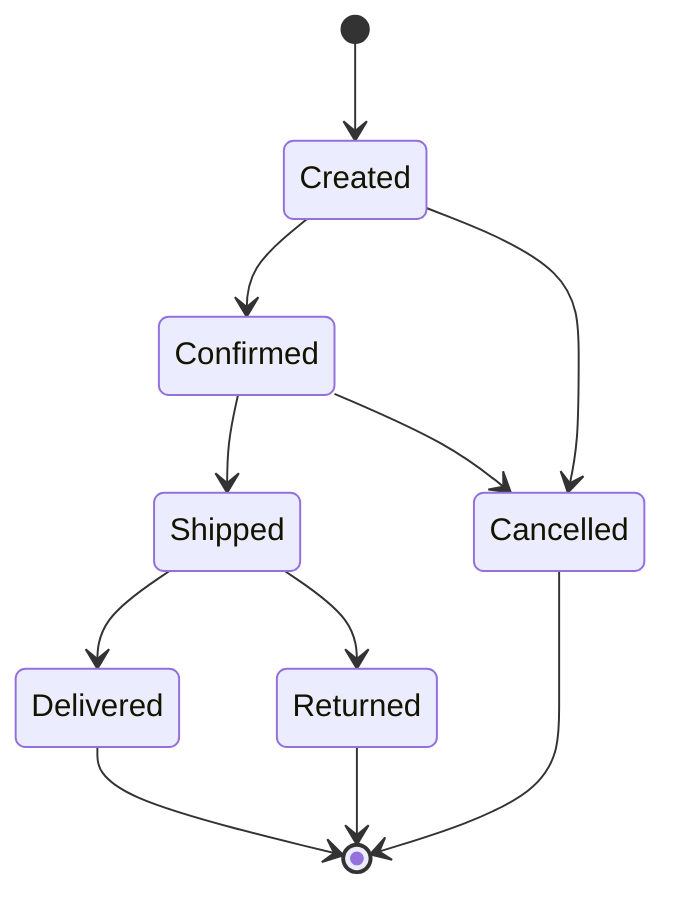

## ADR-042: Event Sourcing for Order Management

### Context

The order management service handles ~50k orders/day with complex state
transitions: created → confirmed → shipped → delivered (with cancellation and
return branches at each stage). The current CRUD approach leads to:

- Lost audit trail when rows are updated in place
- Race conditions during concurrent status changes
- Difficulty replaying scenarios for debugging

### Decision

Adopt **event sourcing** for the order aggregate. Every state change is an
immutable event appended to an event store. Current state is derived by folding
events.

#### Event Schema

| Field        | Type          | Description                         |
| ------------ | ------------- | ----------------------------------- |
| `event_id`   | `uuid`        | Unique event identifier             |
| `stream_id`  | `uuid`        | Aggregate (order) identifier        |
| `version`    | `int`         | Monotonic per stream                |
| `type`       | `string`      | e.g., `OrderCreated`, `ItemShipped` |
| `data`       | `jsonb`       | Event payload                       |
| `metadata`   | `jsonb`       | Correlation ID, actor, timestamp    |
| `created_at` | `timestamptz` | Server-side append time             |

#### Projection Strategy

Read models are rebuilt from events via **catch-up subscriptions**:

```sql
SELECT event_id, stream_id, type, data, metadata
FROM events
WHERE stream_id = $1
ORDER BY version ASC;
```

Projections run in separate processes. Failures don't block writes.

#### Snapshotting

For aggregates with >1000 events, store periodic snapshots:

```json
{
  "stream_id": "order-abc",
  "version": 1042,
  "state": { "status": "shipped", "items": [...] }
}
```

Fold resumes from the snapshot version instead of event zero.

#### State Machine



#### Alert Rule

```promql
sum by (service, status) (
  rate(http_requests_total{service=~"api|worker", status!~"2.."}[5m])
) > 10
```

#### Persisted View Config

```json5
{
  title: "Project health",
  refreshIntervalMs: 15_000,
  filters: {
    teams: ["platform", "growth"],
    environments: ["staging", "prod"],
  },
  panels: [
    { id: "throughput", kind: "timeseries", unit: "req/s" },
    { id: "error-budget", kind: "gauge", thresholds: [99.9, 99.5] },
  ],
}
```

#### API Contract

```graphql
query ProjectSummary($tenant: ID!, $project: ID!) {
  tenant(id: $tenant) {
    id
    name
    project(id: $project) {
      id
      name
      status
      completionPct
      openTasks {
        id
        title
        priority
      }
    }
  }
}
```

### Consequences

**Benefits:**

- Complete audit trail by default
- Temporal queries ("what was the order state at 3pm?") are trivial
- Enables CQRS: optimize reads independently from writes
- Replay for debugging and migration

**Trade-offs:**

- Increased storage (mitigated by snapshotting)
- Eventual consistency for read models (acceptable for this domain)
- Schema evolution requires versioned event upcasters

### References

- [Event Sourcing pattern — Microsoft][ms-es]
- [Versioning in an Event Sourced System — Greg Young][gy-versioning]

[ms-es]:
  https://learn.microsoft.com/en-us/azure/architecture/patterns/event-sourcing
[gy-versioning]: https://leanpub.com/esversioning
